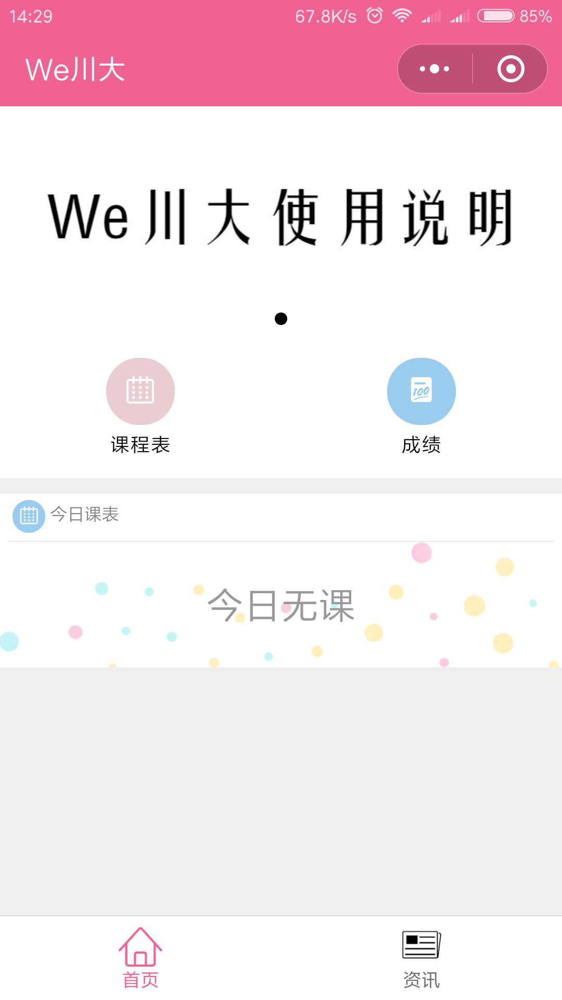
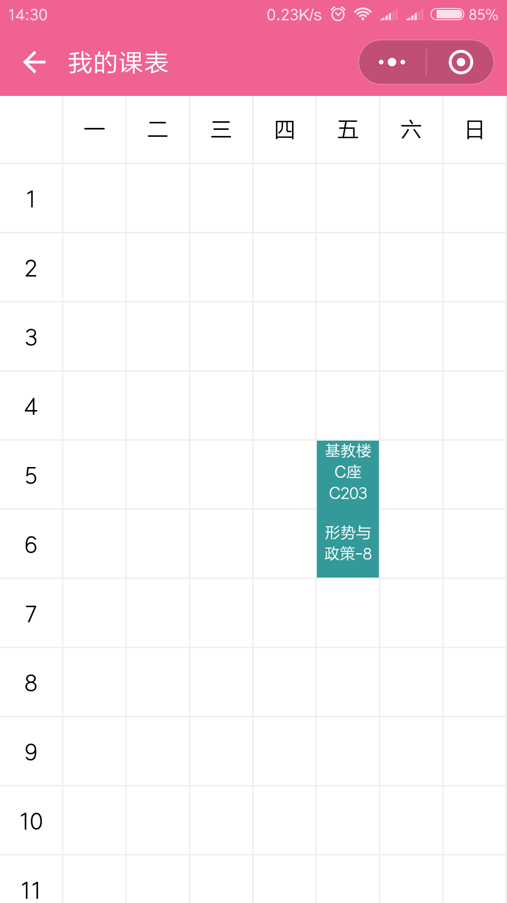
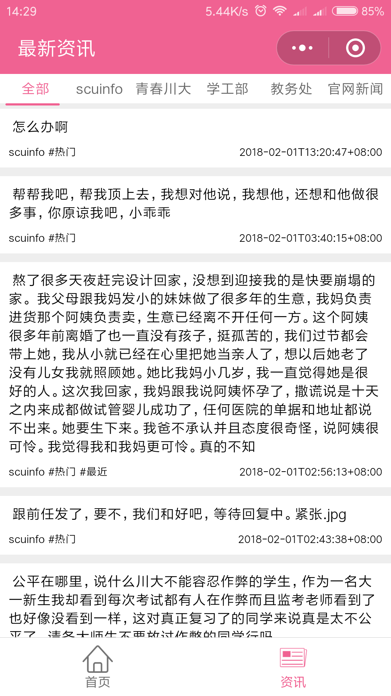
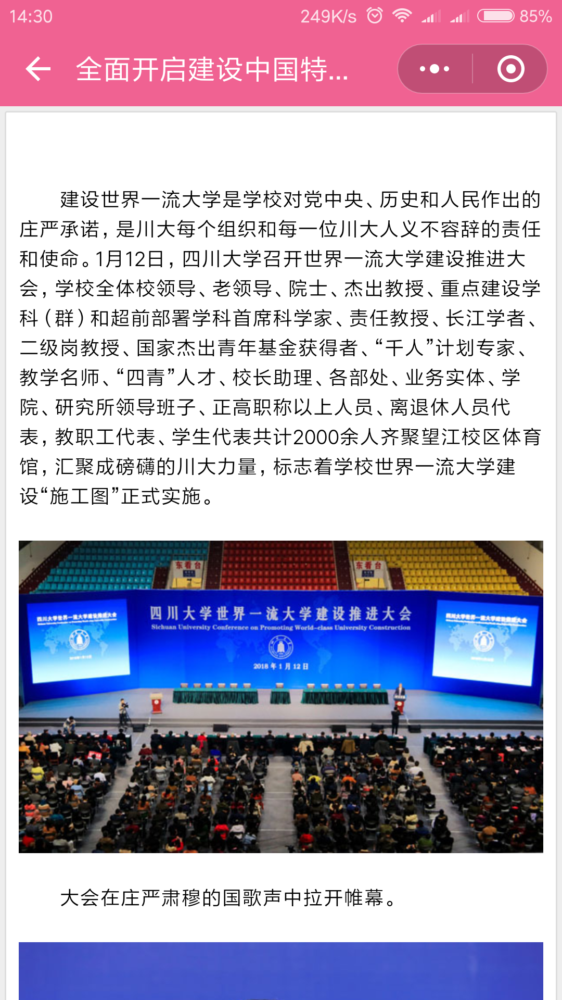

# SCUPLUS - 微信小程序[We川大]

> 这是一个主要服务四川大学师生的一个微信小程序，包含最新资讯/成绩/课程表/考试信息/图书借阅信息等

小程序采用wepy开发，参考了We重邮的界面设计

## 扫码体验
> 可能还在审核当中

## 预览

## Feature && ChangeLog

### 0.1.0 Feature

- [x] 基础框架
- [x] 最新图文资讯(基础版)
  - [x] 青春川大
  - [x] scuinfo
  - [x] 学工部
  - [x] 教务处
  - [x] 川大在线
  - [x] 社团联[暂未在tab显示]

- [x] 课程表
- [x] 成绩(基础版)

### 0.2.0 Feature

- [ ] 图书借阅信息
 - [ ] 当前借阅
 - [ ] 历史借阅
- [ ] 考表

### 0.3.0 Feature
- [ ] 选课助手(基础版)
 - [ ] 课程排名(评价/成绩)
 - [ ] 教师排名(评价/综合)